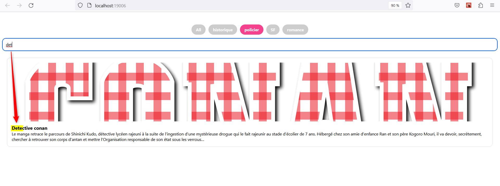

# Gestionnaire de livres

Cette application mobile en React Native a pour objectif d'afficher et de gérer les catégories de livres ainsi que les livres associés à chaque catégorie. L'accent est mis sur l'expérience utilisateur et le design graphique de l'application.

## Fonctionnalités

- Affichage des catégories de livres : L'application affiche toutes les catégories de livres disponibles. Une catégorie spéciale "Tous" permet d'afficher tous les livres, indépendamment de leur catégorie.

- Affichage des livres par catégorie : Lorsqu'une catégorie est sélectionnée, l'application affiche les livres associés à cette catégorie.
  
- Recherche de livres : L'application propose une fonctionnalité de recherche permettant de trouver un livre en saisissant son nom. Les résultats de recherche sont affichés en temps réel.

## Captures d'écran version web 

------------------------------------------------------------------------------------------------------------------------------

## Captures d'ecran version mobile 

------------------------------------------------------------------------------------------------------------------------------

------------------------------------------------------------------------------------------------------------------------------

## Installation

1. Clonez ce référentiel sur votre machine locale.
2. Accédez au répertoire du projet dans votre terminal.
3. Exécutez la commande `npm install` pour installer les dépendances.
4. Connectez votre appareil mobile ou configurez un émulateur.
5. Exécutez la commande `react-native run-android` (ou `react-native run-ios` pour iOS) pour lancer l'application.

## Configuration

Aucune configuration supplémentaire n'est requise pour cette application.

## Utilisation

1. Lancez l'application sur votre appareil mobile ou émulateur.
2. Sur l'écran d'accueil, vous verrez la liste des catégories de livres disponibles.
3. Sélectionnez une catégorie pour afficher les livres associés à cette catégorie.
4. Utilisez la fonction de recherche pour trouver un livre spécifique en saisissant son nom dans la barre de recherche.

## Dépendances

Listez les principales dépendances utilisées dans votre application, ainsi que leurs versions.

- React Native (version 8.19.3 )
- React Navigation (version 8.19.3 )
- React Native Elements (version 8.19.3 )

## Auteurs

- Muthuvel SAVOUNDIRAPANDIANE

